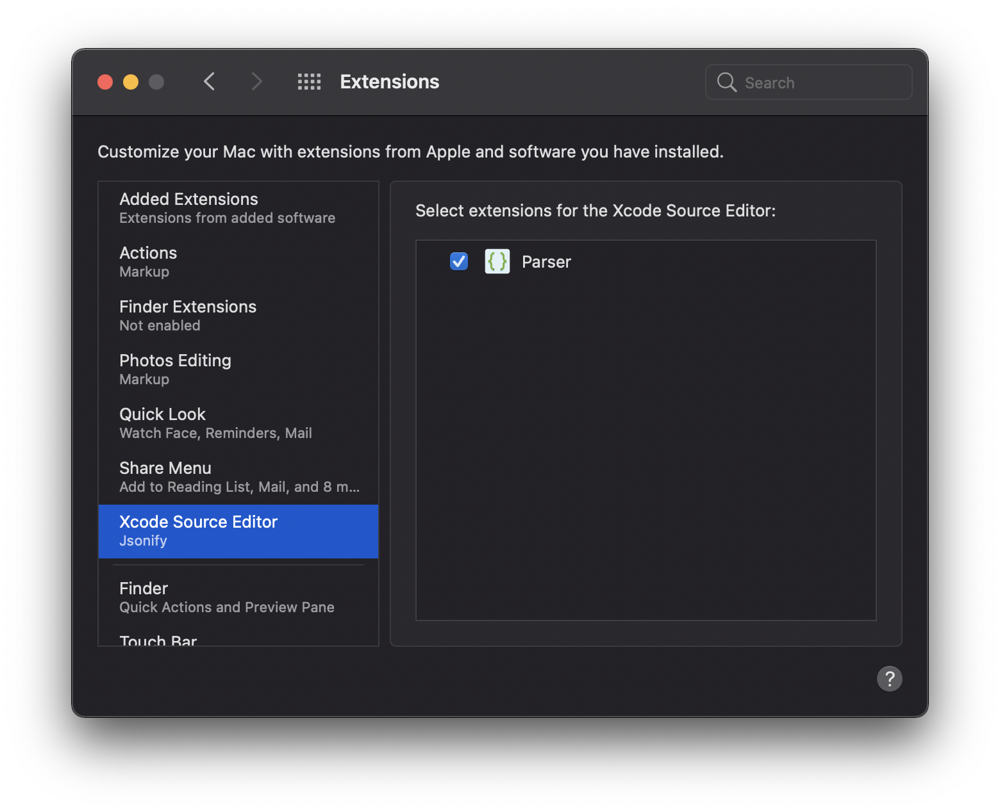
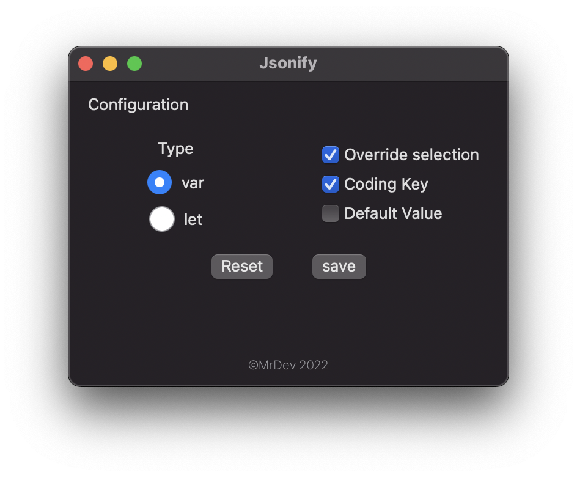
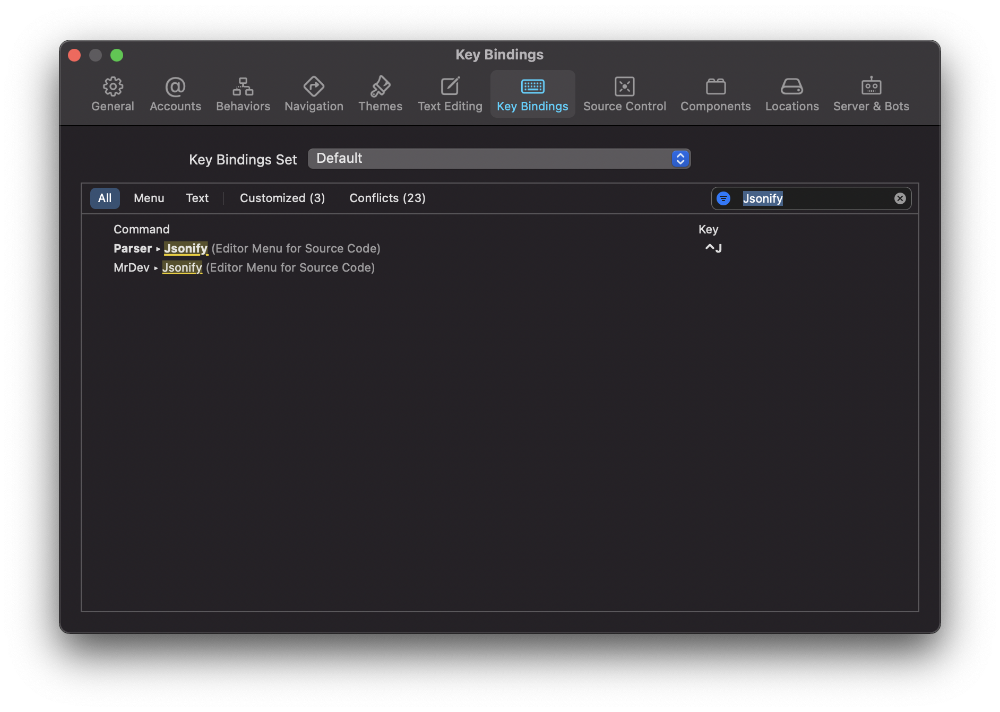

# Jsonify
Generate Swift struct from json string

    

**Jsonify** is an Xcode Source Editor extension that makes it easy to generate Swift struct from json string.

## Features

- [X] ⚒ Generate Swift struct from json string
- [X] ⚒ Initializing properties with default values
- [X] ⚒ Allowing properties to be nullable(?). Determining property nullability automatically
- [X] ⚒ Renaming property names to be camelCase style when selecting a target JSON lib annotation．
- [X] ⚒ Generating Swift struct as individual struct. Generating Swift struct as inner struct．
- [X] ⚡️ Fast, tested, secure.

## Demo

## Installation

- Download latest *Jsonify* package from the [Releases](https://github.com/nguyenvietvu/Xcode-Source-Editor-Extension-Jsonify/releases).
- Copy *Jsonify* to your *Applications* folder.
- Launch *Jsonify* once. You can close it immediately afterwards.
- Go to <kbd>System Preferences</kbd> > <kbd>Extensions</kbd> > <kbd>Xcode Source Editor</kbd> > select <kbd>Jsonify</kbd>

## Configuration
- Type: 'let' or 'var'
- Coding key: add coding key to struct declaration
- Override selection: override struct generated over selection source
- Default value: additional default for properties

## Setting Hotkey in Xcode

- Open Xcode
- Go to Xcode > Preferences > Key Bindings
- Type *'Jsonify'* in search field
- Assign <kbd>⌃</kbd> + <kbd>J</kbd> to *Jsonify* command

## Feedback

Pull requests, issues and suggestions are warmly welcome.

Feel free to contact me [@MrDev on Twitter](https://twitter.com/nguyenvietvu).
